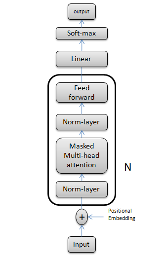

# Generating text using a self-attention model.

In this project, I am going to represent a simple character level attention based decoder for randomly generating reasonably meaningful text.

The first step is to provide a dataset. A simple dataset has been provided as a text file in the repository. we divide the dataset into train and validation.

As we are not going to train the model on the entire dataset, there is a function called 'get_batch' available in utils.py that enables us to load a chunk of data from the dataset.

The model is defined by calling 'GPTLanguageModel()' from 'model.py'

The overall framework of the model is represented as follows:

 

The input is a chunk of sequential words coming from the dataset, and the model will predict the next comming words.

The self-attention block emits two vetors for the each input including Queries and Keys.
Query vector represents what the input vector is looking for  
Key vecor denotes what does the input vector contain.

Self-attention works in a way that it gives a high value output when the query  and key are alligned.

The output of the dot product of Query and key is called affinity matrix.

We pass the afinity matrix hrough a Softmax function and do dot prodoct with Values ( Like Queries and Keys, Values are also a projection of input X).

In each individual Attention block, we used a masked in the case of each token communicate with itself and past tokens only. So in this project it is quite rational to have this masking here.

Notice that the mask values are registered as a buffer so they are not considered as trainable parameters in the optimizer.

Here in this project we used Multi head attention instead of using  a single one. In the code it is defined by MultiHeadAttention class.

###Notice1:
In the case of any deep networks, we probably face optimization issues  (or let's say vanishing gradient issue). To overcome this problem, in the model we added some skip connections (it is sometimes called residual pathways ) to help the model with finding better optimal points. This idea was borrowed from  the paper "deep residual learning for image recognition".

###Notice2:
Like other deep learning models, we need to normalize data before and after each attention block. Therefore, in the model, Layer Normalization is applied according to the paper 'Attention Is All You Need'.

###Notice3:
This project is developed based on character-level input which is somehow not perfectly suitable for sentence generation. Later, it can be improved by a word-level dictionary, which can possibly boost the performance of the generatin text. Also, it can be developed as a machine translation by adding an encoder and also cross-attention in the decoder.

